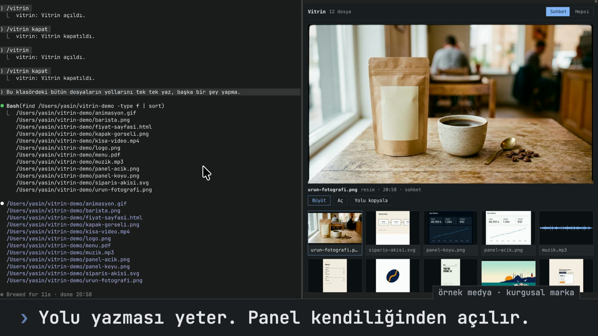

# Claude Code Mods

Claude Code için yazdığım modlar. Her mod kendi klasöründe durur ve tek başına
kurulabilir; ayrıntılar modun kendi README dosyasındadır.

Modlar Claude Code'un mod (function hooks) arayüzüyle yazıldı. Bu arayüz erken
erişimde; sürümler arasında değişebilir.

## Modlar

### [Vitrin](vitrin/)

Claude'un gönderdiği resim, video, PDF, ses, web sayfası ve markdown
belgelerini terminalden çıkmadan sağdaki panelde gösterir.

[](vitrin/)

[Ayrıntılar ve kurulum](vitrin/README.md)

### [Vurgu](vurgu/)

Arka arkaya çalışan araçları tek satıra katlar, senin mesajlarını ve Claude'un
yazılarını seçtiğin renkle vurgular.

Ekran görüntüsü henüz eklenmedi.

[Ayrıntılar ve kurulum](vurgu/README.md)

## Kurulum

Depoyu indir:

```sh
git clone https://github.com/yasinozmeen/claude-code-mods.git ~/claude-code-mods
```

Kullanmak istediğin modların klasörlerini `~/.claude/settings.json` içindeki
`env` bölümüne ekle. Birden fazla klasör `:` ile ayrılır:

```json
"CLAUDE_CODE_PLUGIN_DIRS": "~/claude-code-mods/vitrin:~/claude-code-mods/vurgu"
```

Yeni bir Claude Code oturumu aç. Bir modun ek adımı varsa kendi README
dosyasında yazar.

## Lisans

MIT
